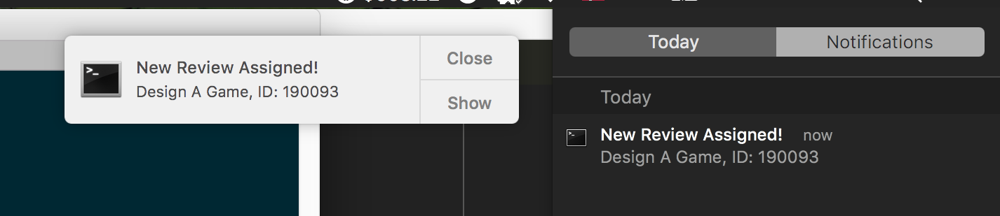

# CLI for Udacity Reviews API
##### API Documentation: https://review.udacity.com/api-doc/index.html

# Description
A CLI for configuring and running API calls against the Udacity Reviews API.

# :arrow_double_down: Installation

### Requirements
- [Node.js](https://nodejs.org/en/download/) v6.0.0 or higher
- NPM (v3.0.0+ highly recommended) (this comes with Node.js)

### Instructions

`rqcli` is a [Node](https://nodejs.org/) module. So, as long as you have Node.js and NPM installed, installing `rqcli` is as simple as running the following command in a terminal:

```sh
$ npm install rqcli --global
```

_Note: requires a node version >= 6 and an npm version >= 3._

### Notifications

The CLI relies on [node-notifier](https://www.npmjs.com/package/node-notifier) for destop notificaitons and has a simple information-rich interface for the terminal.

Desktop Notifications on a Mac:



CLI prompt


# :clipboard: Setup

##### LEGEND
- Arguments inside `< >` are required.
- Arguments inside `[ ]` are optional.
- Arguments that start with `--` are options.
- Arguments that start with `-` are shortcuts for an option.

##### Step-By-Step Guide
1. Navigate to the folder you want to use for your work with reviews.
1. Get the token from the API.
    - Navigate to the [Reviews Dashboard](https://review.udacity.com/#!/submissions/dashboard).
    - Click on API Access:
    - 
    - Copy the token.
1. Run `rqcli setup <yourToken>`. Some tokens include dashes (`-`) and these must be in quotes (`"token-moretoken"`). This will create the `api` folder where your token and certifications are stored.
    - The command lets you know if any submissions are currently assigned to you, and also if there are any unread feedbacks from the last 30 days.
    - You can add the option `--notify` to get desktop notifications of any unread feedbacks and active reviews.
1. The most common task when using this CLI, will be to start requesting assignments from the Udacity Reviews API. Do this by using the `assign` command.

# :nut_and_bolt: CLI commands

#### `setup`
- Command: `rqcli setup <token>`
- Description: _Sets up a folder, `api`, in the current directory, with all the information needed to start authenticating against the Udacity Reviews API. This command combines the four commands, `token`, `certs`, `assigned` and `feedbacks` into one._
- Arguments: `<token>`, your token which you can copy from your dashboard > API Access. Some tokens include dashes (`-`) and these must be in quotes (`"token-moretoken"`).
- Options: `-n`, `--notify`, uses desktop notifications to notify the user of updates.

#### `assign`
- Command: `rqcli assign <projectId> [moreIds] --feedbacks --notify`
- Description: _Starts requesting the Udacity Review API queue for assignments of the type specified in the commands arguments._
- Arguments: `<projectId> [moreIds...]`, space separated list of project ids to request for.
- Options:
    - `-f`, `--feedbacks`, periodically checks for new feedbacks (default is set to once per hour).
    - `-n`, `--notify`, uses desktop notifications to notify the user of updates.
- Tip: You can use the list of arguments to weigh the requested projects. If for instance, your list looked like this `rqcli assign 144 144 134 4`, the project `144` would take up half of all the calls to the API.
- Example Usage: `rqcli assign 144 144 144 134 -fn`. This will request assignments for project 144 three times and then 134 one time. It will keep doing that in a loop. It will also use desktop notifications to notify the user of new assignments and any unread feedbacks.

#### `money`
- Command: `rqcli money [months] --from --to`
- Description: _Gets all completed reviews and returns earnings reports for the periods specified by the user._
- Arguments: `[months]`, space separated list of months to report on.
- Options:
    + `-f`, `--from <date>`, date in the format, `YYYY-MM-DDT00:00:00`, from which to calculate earnings. If the `--to` option is not defined, the period reported on will be from the `--from <date>` date to now.
    + `-t`, `--to <date>`, date in the format, `YYYY-MM-DDT00:00:00`, to which to calculate earnings. If the `--from` option is not defined, the period reported on will be from the date of the first review to the `--to <date>` date.
- Example Usage: `rqcli money 3 4 --from 2016-01-01 --to 2016-07-26`. This request will return three earnings reports:
    + An earnings report for the full month of March of 2016.
    + An earnings report for the full month of April of 2016.
    + An earnings report for the year 2016 up to (but _not_ including) July 26th.
- Tip:
    + To add a month from the previous year, simply use the format `YYYY-MM`.
    + If you add a month that is in the future, the command will return information from that month, but from the previous year instead.
    + If you simply use `rqcli money` you will get a total of all you have earned up to now.

#### `review`
- Command: `rqcli review`
- Description: _Times and logs a review. Potentially also runs scritps for certain project types._
- Example Usage: `rqcli review`.

#### `token`
- Command: `rqcli token <token>`
- Description: _Stores an API Auth token and the day-of-year to be able to calculate the tokens age._
- Arguments: `<token>`, the API authentication token which is available from the reviews dashboard > API Access. Some tokens include dashes (`-`) and these must be in quotes (`"token-moretoken"`).

#### `certs`
- Command: `rqcli certs --update`
- Description: _Displays all of the project names with ids for which the authenticated user is certified._
- Options: `-u`, `--update`, updates certifications.

#### `assigned`
- Command: `rqcli assigned`
- Description: _Notifies the user of all submissions that are currently assigned to them._
- Options: `-n`, `--notify`, uses desktop notifications to notify the user of updates.

#### `feedbacks`
- Command: `rqcli feedbacks`
- Description: _Checks for unread feedbacks from the last 30 days_
- Options: `-n`, `--notify`, uses desktop notifications to notify the user of updates.

# :black_nib: Project Styleguide

[](https://github.com/feross/standard)

[Why no simecolons?](https://www.youtube.com/watch?v=Qlr-FGbhKaI&index=11&list=PL0zVEGEvSaeH21VDycWYNWU7VKUA-xLzg)

# :+1: Contribution Guidelines

##### Steps

1. Fork this repository
2. `git clone` your fork down to your local machine
3. Submit a PR for any contributions.

# License

ISC. See [LICENSE](LICENSE).
